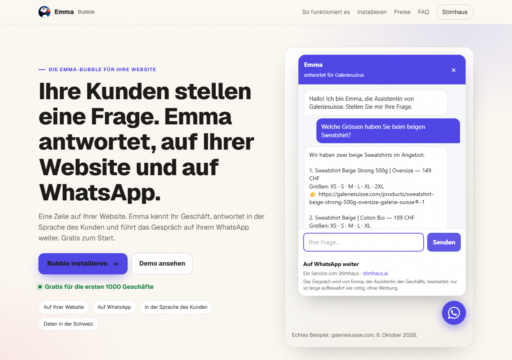

# Emma Bubble — Emma, die KI von Stimhaus, auf der Website Ihres Geschäfts

[English](README.md) · [Français](README.fr.md)

**Eine Zeile einfügen. Emma antwortet Ihren Kunden auf Ihrer Website und auf WhatsApp.**

Emma ist die KI-Assistentin von [Stimhaus](https://stimhaus.ai) für kleine Geschäfte (Läden, Salons, Restaurants, Werkstätten, Praxen…). Die Emma-Bubble ist ein kleiner runder Knopf unten rechts auf Ihrer Website. Ihre Kunden stellen eine Frage; Emma antwortet aus dem, was Sie ihr über Ihr Geschäft gesagt haben, und aus Ihrer Website — Öffnungszeiten, Adresse, Leistungen, Preise, Produkte Ihres Onlineshops — in der Sprache des Kunden.

- Am **Computer**: das Gespräch öffnet sich in der Seite.
- Am **Telefon**: die Bubble öffnet **WhatsApp**. Der Kunde führt das Gespräch dort weiter, Sie sehen alles auf Ihrem WhatsApp und übernehmen, wann Sie wollen.



## Installation in einer Zeile

```html
<script src="https://stimhaus.ai/emma.js" data-site="IHRE-ID" data-name="Ihr Geschäft"></script>
```

Ersetzen Sie `IHRE-ID` und `Ihr Geschäft` durch die Werte, die Emma Ihnen gibt (siehe unten), und fügen Sie die Zeile direkt vor dem schliessenden `</body>`-Tag ein.

| Plattform | Wo |
|---|---|
| WordPress | Ein Plugin für Header- und Footer-Code → Bereich „Footer“; oder im Theme, vor `</body>` |
| Wix | Einstellungen → Benutzerdefinierter Code → Code hinzufügen → „Body – Ende“ |
| Shopify | Onlineshop → Themes → Code bearbeiten → `theme.liquid`, vor `</body>` |
| Squarespace | Einstellungen → Erweitert → Code-Injektion → „Footer“ |
| HTML-Website | Vor `</body>` im Layout — siehe [Beispiele](examples/) |

Option: `data-lang="de"` legt die Rückfallsprache fest, wenn die Browsersprache des Besuchers nicht unterstützt wird (`fr`, `en`, `de`, `it`, `es`, `pt`).

## Ihre ID erhalten

Schreiben Sie Emma auf WhatsApp mit der Adresse Ihrer Website — Nummer und QR-Code finden Sie auf [stimhaus.ai/bulle](https://stimhaus.ai/bulle). Emma liest Ihre Website und schickt Ihnen die genaue Zeile zum Einfügen. Noch keine Website? Emma erstellt sie mit Ihnen auf [stimhaus.ai](https://stimhaus.ai), Bubble inklusive.

## Die Bubble aktivieren

Sobald die Zeile auf Ihrer Website ist, bestätigen Sie die Bubble bei Emma auf WhatsApp (oder indem Sie am Computer den Code in der Bubble scannen): Emma zeigt Ihnen eine Zusammenfassung dessen, was sie antworten wird, und Sie bestätigen, dass es Ihr Geschäft ist und die Angaben stimmen. Bis dahin zeigt die Bubble den Besuchern, wie sie aktiviert wird, und sie wird nach 7 Tagen ohne Bestätigung entfernt. Nach der Bestätigung ist die Bubble innerhalb einer Minute aktiv.

Ein Agent oder ein Webentwickler kann die Zeile für Sie einfügen; bestätigen können nur Sie.

## FAQ

**Ist WhatsApp Pflicht?** Ja: dort spricht Emma mit Ihnen, und dort führen Ihre Kunden das Gespräch vom Telefon aus weiter. Am Computer können sie auch direkt in der Seite chatten.

**In welchen Sprachen antwortet Emma?** In der Sprache des Besuchers: Deutsch, Französisch, Englisch, Italienisch und weitere. Ihre Website bleibt in der Sprache, die Sie gewählt haben.

**Wohin gehen die Daten?** Die Gespräche werden auf unseren Servern in der Schweiz aufbewahrt. Emmas Antworten werden von einem Dienst für künstliche Intelligenz erzeugt, der sich ausserhalb der Schweiz befinden kann. Ohne Werbung. Nichts wird verkauft. Details: [stimhaus.ai/confidentialite](https://stimhaus.ai/confidentialite).

**Können KI-Assistenten mit meinem Geschäft sprechen?** Ja, sobald die Bubble bestätigt ist: Ihr Geschäft erhält auch eine Tür für KI-Assistenten (A2A-Protokoll). Ein Assistent kann dort dieselben Fragen stellen wie ein Besucher – Öffnungszeiten, Leistungen, Preise, Anfahrt, Buchung. Diese Austausche zählen zu Ihren Kundennachrichten und sind begrenzt; Ihre Telefonnummer wird Assistenten nicht weitergegeben.

**Kann ich sie entfernen?** Löschen Sie die Zeile. Sonst ist nichts installiert.

**Was kostet es?** Wie auf [stimhaus.ai/pricing](https://stimhaus.ai/pricing): Light ist gratis für die ersten 1000 Geschäfte (danach 19 CHF/Monat), 1 Website und 100 Kundennachrichten pro Monat (Gespräche mit Agenten zählen dazu); Pro kostet 49 CHF/Monat, unbegrenzte Nachrichten bei normaler Nutzung, eigene WhatsApp-Nummer, automatische Termine, bis zu 5 Websites.

## Für Agenten und Entwickler

- Skill (die Bubble für ein Geschäft installieren): https://stimhaus.ai/bulle/skill.md
- Agenten-Tür eines Geschäfts mit bestätigter Bubble (A2A, ohne Schlüssel): `https://stimhaus.ai/agent/<ID>/agent-card.json`
- Emma für KI-Agenten (eine Website für Ihren eigenen Agenten): https://stimhaus.ai/agents

## Lizenz

Die HTML-Beispiele im Ordner [examples/](examples/) stehen unter der MIT-Lizenz (siehe [LICENSE](LICENSE)). Das Skript `emma.js` wird von Stimhaus auf stimhaus.ai bereitgestellt und ist nicht Teil dieser Lizenz.
