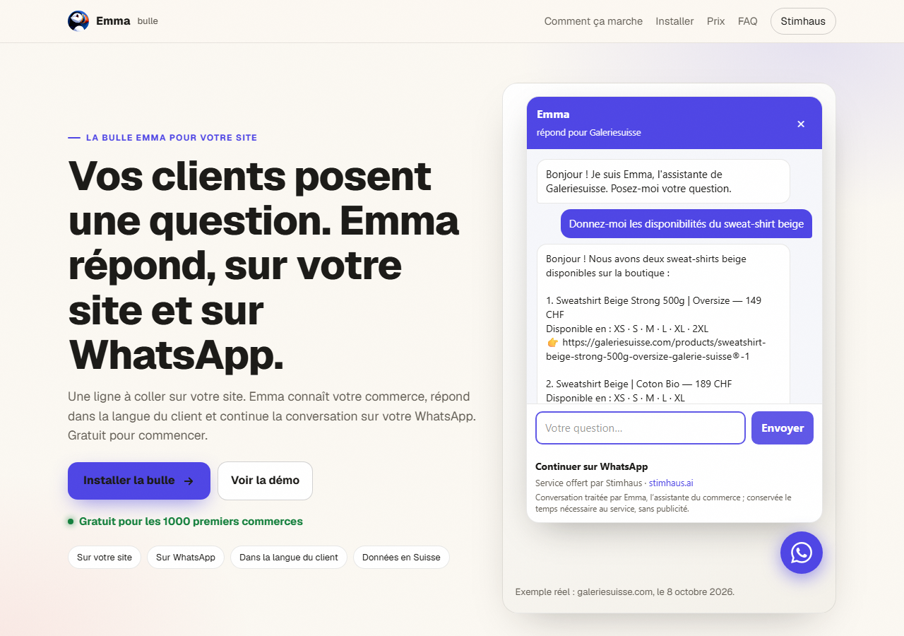

# Emma bulle — Emma, l'IA de Stimhaus, sur le site de votre commerce

[English](README.md) · [Deutsch](README.de.md)

**Une ligne à coller. Emma répond à vos clients sur votre site et sur WhatsApp.**

Emma est l'assistante IA de [Stimhaus](https://stimhaus.ai) pour les petits commerces (boutiques, salons, restaurants, ateliers, cabinets…). La bulle Emma est un petit bouton rond en bas à droite de votre site. Vos clients posent une question ; Emma répond à partir de ce que vous lui avez dit de votre commerce et de votre site — horaires, adresse, services, prix, produits de votre boutique en ligne — dans la langue du client.

- Sur **ordinateur** : la discussion s'ouvre dans la page.
- Sur **téléphone** : la bulle ouvre **WhatsApp**. Le client garde le fil là-bas, vous voyez tout sur votre WhatsApp et vous reprenez la main quand vous voulez.



## Installer en une ligne

```html
<script src="https://stimhaus.ai/emma.js" data-site="VOTRE-ID" data-name="Votre commerce"></script>
```

Remplacez `VOTRE-ID` et `Votre commerce` par les valeurs qu'Emma vous donne (voir plus bas), puis collez la ligne juste avant la balise de fin `</body>`.

| Outil | Où |
|---|---|
| WordPress | Une extension d'insertion de code (en-tête et pied de page) → zone « Pied de page » ; ou dans votre thème, avant `</body>` |
| Wix | Paramètres → Code personnalisé → Ajouter du code → « Fin du body » |
| Shopify | Boutique en ligne → Thèmes → Modifier le code → `theme.liquid`, avant `</body>` |
| Squarespace | Paramètres → Avancé → Injection de code → « Pied de page » |
| Site HTML | Avant `</body>` dans votre gabarit — voir les [exemples](examples/) |

Option : `data-lang="fr"` fixe la langue de repli quand la langue du navigateur du visiteur n'est pas prise en charge (`fr`, `en`, `de`, `it`, `es`, `pt`).

## Obtenir votre identifiant

Écrivez à Emma sur WhatsApp avec l'adresse de votre site — le numéro et un code QR sont sur [stimhaus.ai/bulle](https://stimhaus.ai/bulle). Emma lit votre site et vous renvoie la ligne exacte à coller. Pas encore de site ? Emma le crée avec vous sur [stimhaus.ai](https://stimhaus.ai), bulle comprise.

## Activer la bulle

Une fois la ligne sur votre site, vous validez la bulle avec Emma sur WhatsApp (ou en scannant le code affiché dans la bulle sur ordinateur) : Emma vous montre un résumé de ce qu'elle répondra, et vous confirmez que c'est bien votre commerce et que les informations sont justes. D'ici là, la bulle indique aux visiteurs comment l'activer, et elle est retirée après 7 jours sans validation. Une fois validée, la bulle est active en moins d'une minute.

Un agent ou un développeur web peut coller la ligne pour vous ; vous seul pouvez la valider.

## FAQ

**WhatsApp est-il obligatoire ?** Oui : c'est là qu'Emma vous parle, et là que vos clients continuent la conversation depuis leur téléphone. Sur ordinateur, ils peuvent aussi discuter directement dans la page.

**Dans quelles langues Emma répond-elle ?** Dans la langue du visiteur : français, allemand, anglais, italien et d'autres. Votre site reste dans la langue que vous avez choisie.

**Où vont les données ?** Les conversations sont conservées sur nos serveurs en Suisse. Les réponses d'Emma sont produites par un service d'intelligence artificielle, qui peut se trouver hors de Suisse. Sans publicité. Rien n'est vendu. Détails : [stimhaus.ai/confidentialite](https://stimhaus.ai/confidentialite).

**Les assistants IA peuvent-ils parler à mon commerce ?** Oui, une fois la bulle validée : votre commerce reçoit aussi une porte pour les assistants IA (protocole A2A). Un assistant peut y poser les mêmes questions qu'un visiteur — horaires, services, prix, accès, comment réserver. Ces échanges comptent dans vos messages clients et sont limités ; votre numéro de téléphone n'est pas donné aux assistants.

**Puis-je l'enlever ?** Effacez la ligne. Rien d'autre n'est installé.

**Combien ça coûte ?** Comme sur [stimhaus.ai/pricing](https://stimhaus.ai/pricing) : Light est gratuit pour les 1000 premiers commerces (ensuite 19 CHF/mois), 1 site et 100 messages clients par mois (les échanges avec les agents y comptent) ; Pro est à 49 CHF/mois, messages illimités pour un usage normal, numéro WhatsApp dédié, rendez-vous automatiques, jusqu'à 5 sites.

## Pour les agents et les développeurs

- Skill (installer la bulle pour un commerce) : https://stimhaus.ai/bulle/skill.md
- Porte d'agent d'un commerce dont la bulle est validée (A2A, sans clé) : `https://stimhaus.ai/agent/<ID>/agent-card.json`
- Emma pour les agents IA (un site pour votre propre agent) : https://stimhaus.ai/agents

## Licence

Les exemples HTML du dossier [examples/](examples/) sont sous licence MIT (voir [LICENSE](LICENSE)). Le script `emma.js` est servi par Stimhaus depuis stimhaus.ai et ne fait pas partie de cette licence.
