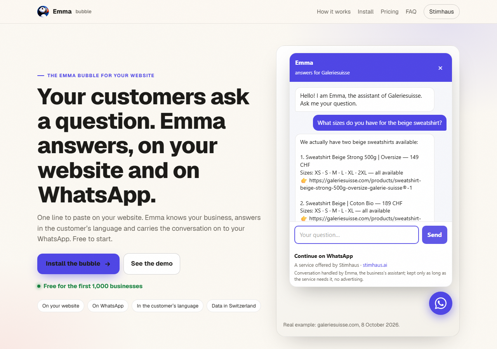

# Emma bubble — Emma, Stimhaus' AI, on your business website

[Français](README.fr.md) · [Deutsch](README.de.md)

**One line to paste. Emma answers your customers on your website and on WhatsApp.**

Emma is the AI assistant of [Stimhaus](https://stimhaus.ai) for small businesses (shops, salons, restaurants, workshops, practices…). The Emma bubble is a small round button, bottom right of your website. Your customers ask a question; Emma answers from what you told her about your business and from your website — opening hours, address, services, prices, products of your online shop — in the customer's language.

- On a **computer**: the chat opens inside the page.
- On a **phone**: the bubble opens **WhatsApp**. The customer keeps the thread there, you see everything on your WhatsApp and take over whenever you want.



## Install in one line

```html
<script src="https://stimhaus.ai/emma.js" data-site="YOUR-ID" data-name="Your business"></script>
```

Replace `YOUR-ID` and `Your business` with the values Emma gives you (see below), then paste the line just before the closing `</body>` tag.

| Platform | Where |
|---|---|
| WordPress | A "header and footer code" plugin → Footer area; or your theme, before `</body>` |
| Wix | Settings → Custom code → Add code → Body – end |
| Shopify | Online store → Themes → Edit code → `theme.liquid`, before `</body>` |
| Squarespace | Settings → Advanced → Code injection → Footer |
| Any HTML site | Before `</body>` in your layout — see [examples](examples/) |

Optional: `data-lang="en"` sets the fallback language when the visitor's browser language is not supported (`fr`, `en`, `de`, `it`, `es`, `pt`).

## Getting your ID

Write to Emma on WhatsApp with your website address — the number and a QR code are on [stimhaus.ai/bulle](https://stimhaus.ai/bulle). Emma reads your website and sends you back the exact line to paste. No website yet? Emma builds it with you on [stimhaus.ai](https://stimhaus.ai), bubble included.

## Activating the bubble

Once the line is on your website, you validate the bubble with Emma on WhatsApp (or by scanning the code shown in the bubble on a computer): Emma shows you a summary of what she will answer, and you confirm it is your business and the information is correct. Until then, the bubble shows visitors how to activate it, and it is removed after 7 days without validation. Once validated, the bubble is active within a minute.

An agent or a web developer can paste the line for you; only you can validate it.

## FAQ

**Do I need WhatsApp?** Yes: that is where Emma talks to you, and where your customers continue the conversation from their phone. On a computer they can also chat directly in the page.

**Which languages does Emma answer in?** The visitor's language: French, German, English, Italian and others. Your website stays in the language you chose.

**Where does the data go?** Conversations are kept on our servers in Switzerland. Emma's answers are produced by an artificial-intelligence service, which may be located outside Switzerland. No advertising. Nothing is sold. Details: [stimhaus.ai/confidentialite](https://stimhaus.ai/confidentialite).

**Can AI assistants talk to my business?** Yes, once the bubble is validated: your business also gets a door for AI assistants (A2A protocol). An assistant can ask it the same questions as a visitor — opening hours, services, prices, location, how to book. These exchanges count towards your customer messages and are limited; your phone number is not given to assistants.

**Can I remove it?** Delete the line. Nothing else is installed.

**What does it cost?** As on [stimhaus.ai/pricing](https://stimhaus.ai/pricing): Light is free for the first 1,000 businesses (then 19 CHF/month) with 1 website and 100 customer messages per month (agent conversations count in them); Pro is 49 CHF/month with unlimited messages for normal business use, a dedicated WhatsApp number, automatic appointments and up to 5 websites.

## For agents and developers

- Skill (how to install the bubble for a business): https://stimhaus.ai/bulle/skill.md
- Agent door of a business whose bubble is validated (A2A, no key): `https://stimhaus.ai/agent/<ID>/agent-card.json`
- Emma for AI agents (a website for your own agent): https://stimhaus.ai/agents

## License

The HTML examples in [examples/](examples/) are under the MIT license (see [LICENSE](LICENSE)). The script `emma.js` is served by Stimhaus from stimhaus.ai and is not part of this license.
